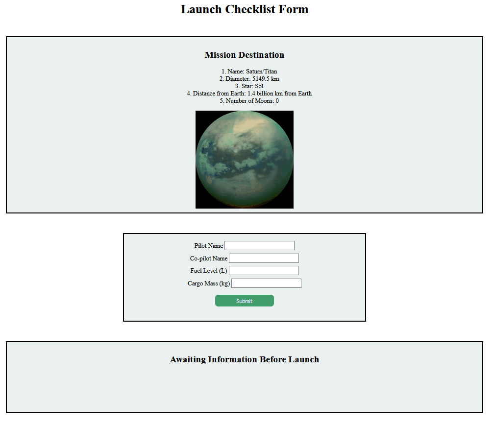

<h1>Launch Checklist Form</h1>

## Purpose
Class Project: The Launch Checklist Form makes it easy for astronaut's to validate the information necessary to ensure a safe and successful launch of the group's vessel.

## Skills
<ul>
<li>JavaScript</li>
<li>the DOM</li>
<li>HTTP</li>
<li>HTML and Forms / CSS</li>
</ul>

## Features

<ul>
<li>Validate the user responses;</li>
<li>Update a list of what is currently ready or not ready for the shuttle launch;</li>
<li>Indicate what is good or bad about the shuttle and whether it is ready for launch by using the DOM to update the CSS;</li>
<li>Fetch JSON to update the mission destination with vital facts and figures about where the shuttle is headed.</li>
</ul>
